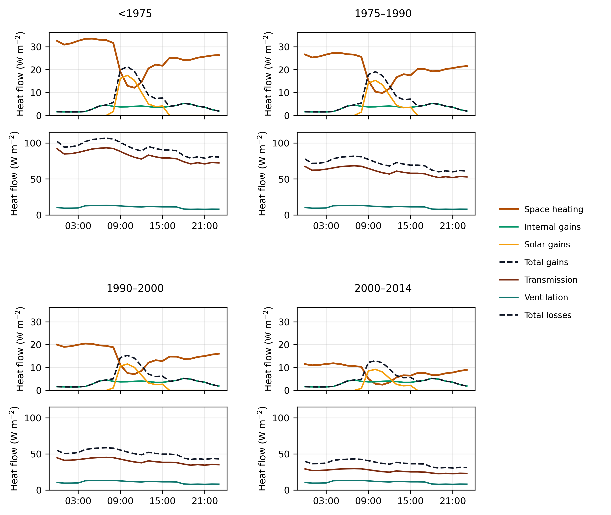
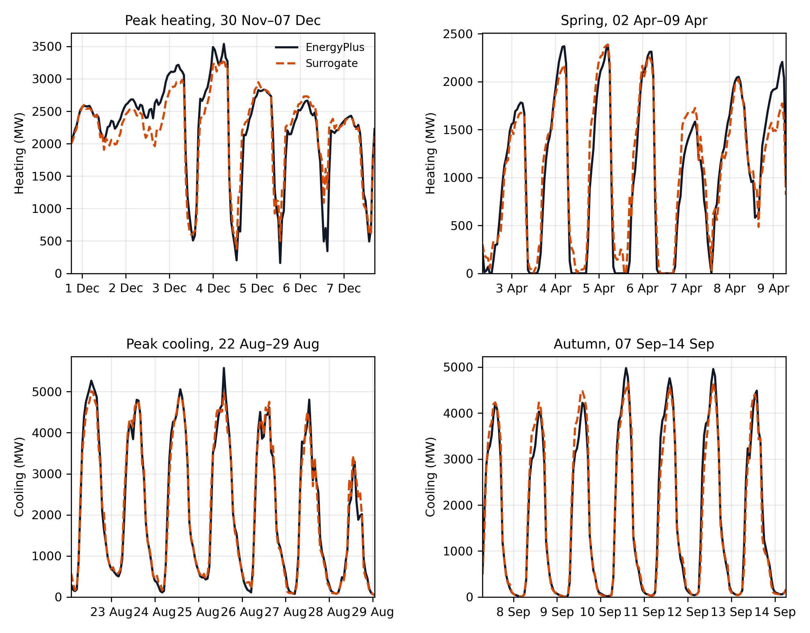
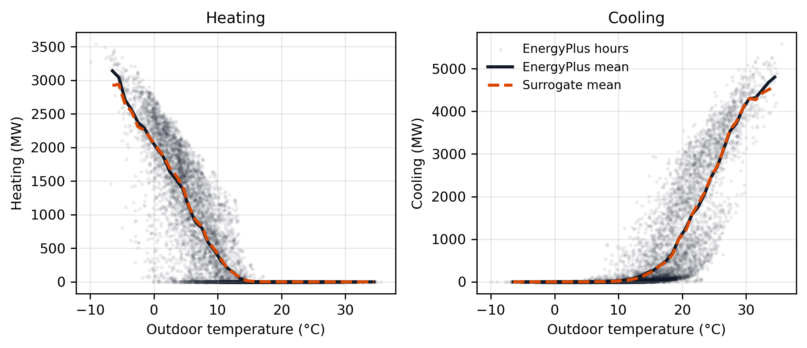

# EnergyPlus-trained hourly heating and cooling for Vienna building cohorts

Philipp Groiss  
Affiliation to be inserted

## Abstract

The paper covers the Citiwatts Vienna building stock: 135 million m² gross floor area, split into eight cohorts (housing and other buildings, four construction periods). EnergyPlus is not run on the city as one giant zone. Each cohort is represented by a 1000 m² slice with the stock’s envelope ratios; the hourly useful heating and cooling from that slice, in kWh m⁻², is then multiplied by the cohort’s Citiwatts floor area. That product is the Vienna load used here. A tree ensemble learns those intensities from weather, time of day and the envelope. On calendar weeks left out of training, hourly R² is 0.959 for heating and 0.975 for cooling. After the floor-area scaling, city annual energy is 1.7% high for heat and 0.8% low for cool; the peak hour is still 6.7% and 10.1% low. One EnergyPlus city year (schedules, engine, SQL extract) takes 67.1 s; the fitted emulator evaluates the same 70 080 hours in 1.73 s. Setpoint events and load shifting are outside the scope.

**Keywords:** EnergyPlus; building stock; demand surrogate; space heating; cooling; Vienna

## 1. Introduction

Hourly heating and cooling profiles are an important input to energy-system models with high shares of renewable energy. Annual demand alone does not show when heat pumps draw electricity, when heating coincides with a winter peak, or when cooling increases the summer load. These questions require a building model that responds to weather, solar and internal gains, occupancy schedules, the thermal envelope and the operation of the heating and cooling systems. Simple degree-day relations or fixed normalized profiles can reproduce an annual total, but they do not represent these interactions explicitly.

EnergyPlus provides a considerably richer description of building demand
[1,2]. It solves the transient heat balance of the building and accounts for
heat transfer through opaque surfaces and windows, ventilation and
infiltration, solar radiation, internal gains, thermal storage and HVAC
controls. Heating and cooling loads therefore follow from the same physical
balance instead of being imposed as independent profiles. EnergyPlus is also a
widely used and extensively documented building-performance simulation
program. This does not make every EnergyPlus result accurate by default:
geometry, material properties, schedules and weather still have to represent
the case under study. Given suitable inputs, however, it offers a more
defensible basis for deriving hourly building loads than a profile assembled
from annual energy and outdoor temperature alone.

The detail that makes EnergyPlus useful also complicates its integration into
larger models. A city-scale application requires several representative
buildings, input files and schedules, repeated annual simulations and the
extraction of results from EnergyPlus output files. Direct coupling becomes
particularly burdensome when building demand is evaluated repeatedly inside a
scenario analysis or an optimization model. In such settings, thousands of
model evaluations may be required. The building simulation can then become a
computational and technical bottleneck even when an individual annual run is
not prohibitively slow.

A surrogate model offers a practical division of work. EnergyPlus is retained
offline as the detailed teacher, while a statistical model learns the mapping
from weather, operating conditions and building properties to useful heating
and cooling demand. Once trained, the surrogate can be called directly by an
energy-system model without constructing and executing a new EnergyPlus run.
The gain in speed is only useful if the surrogate preserves the annual energy,
hourly variation, seasonal transition and peak demand produced by its teacher.
Validation must therefore cover more than a single aggregate error.

This paper demonstrates that approach for the Vienna building stock. Citiwatts
floor area and construction-period data are represented by eight residential
and non-residential cohorts. EnergyPlus simulations of the 2023 weather year
provide hourly useful heating and cooling for each cohort, and a
gradient-boosting surrogate emulates these outputs. The study addresses three
questions: (1) how accurately the surrogate reproduces held-out hourly
EnergyPlus results, (2) whether this accuracy is retained after aggregation to
the Vienna stock, including seasonal and peak periods, and (3) how much
computation time is saved. Building flexibility, dispatch and energy-system
optimization are not evaluated here.

## 2. Materials and Methods

### 2.1 Case Study and Building-Stock Representation

The case study covers the building stock within the Vienna boundary represented
in the Citiwatts inventory [5]. The inventory reports a gross floor area of
134.6 million m² and a heated volume of 403.7 million m³. Residential buildings
account for 89.0 million m² of floor area and non-residential buildings for
45.5 million m². The reported annual heat consumption is 17.54 TWh. This value
includes domestic hot water and serves as a top-down energy-balance reference;
it is distinct from the useful space-heating output of the EnergyPlus
simulations.

The stock was divided by sector and construction period. Residential and
non-residential buildings were each assigned to four periods: before 1975,
1975–1990, 1990–2000 and 2000–2014. The corresponding shares were 54%, 24%, 4%
and 17%, respectively, before normalization. Applying these shares within each
sector produced the eight cohorts listed in Table 1. Their floor areas sum to
the full Citiwatts inventory; the cohort set is therefore an aggregated
representation of the Vienna stock rather than a sample of individual
buildings.

**Table 1.** Vienna building-stock representation derived from Citiwatts.

| Sector          | Construction period | Represented floor area (10⁶ m²) |
| --------------- | ------------------- | ------------------------------- |
| Residential     | Before 1975         | 48.6                            |
| Residential     | 1975–1990           | 21.6                            |
| Residential     | 1990–2000           | 3.6                             |
| Residential     | 2000–2014           | 15.3                            |
| Non-residential | Before 1975         | 24.8                            |
| Non-residential | 1975–1990           | 11.0                            |
| Non-residential | 1990–2000           | 1.8                             |
| Non-residential | 2000–2014           | 7.8                             |
| **Total**       |                     | **134.6**                       |

For the wider Vienna energy-system data set, residential domestic-hot-water
demand is estimated at 15.5 kWh m⁻² a⁻¹ and separated from the inventory heat
total. Domestic hot water is not simulated or predicted in the present study.
Likewise, the annual Citiwatts heat consumption is not used as a regression
target. The purpose of Citiwatts in this paper is to define the extent and
composition of the stock and to provide the floor-area weights used for city
aggregation. A subsequent energy-system application may normalize the
EnergyPlus-derived hourly profile and apply an externally specified annual
energy total, but that step is outside the validation reported here.

### 2.2 EnergyPlus Reference Simulations

One EnergyPlus 26.1 model was prepared for each cohort [2]. The models represent
equivalent building-stock archetypes rather than particular buildings. A
conditioned reference floor area of 1000 m² was used in all simulations. This
common reference area keeps the model geometry within a plausible archetype
scale and permits the simulation outputs to be expressed as demand intensities.
It does not limit the represented stock to 1000 m². All envelope areas, internal
gains and air volumes were scaled consistently with the reference floor area;
the resulting specific demand can therefore be applied to the corresponding
cohort area.

The ratio of Citiwatts volume to floor area gives a reference room height of
approximately 3 m and hence a conditioned volume of approximately 3000 m³.
Residential envelope geometry was based on Austrian TABULA apartment-block
ratios: wall, window, roof and exposed-floor areas of 0.82, 0.18, 0.37 and
0.36 m² per m² conditioned floor area, respectively [6,7]. The corresponding
ratios for the non-residential archetypes were 0.30, 0.12, 0.30 and 0.30.
Period-specific U-values represented the change in envelope quality across the
four construction periods. For example, the wall U-value decreased from
1.40 W m⁻² K⁻¹ for the pre-1975 cohort to 0.35 W m⁻² K⁻¹ for the 2000–2014
cohort. In the absence of a separate Vienna non-residential typology, the same
period-dependent U-value classes were used for both sectors, while sector-
specific geometry and schedules were retained.

Each archetype was simulated for the 8760 h of 2023. Outdoor temperature and
solar radiation were obtained from Open-Meteo and converted to a pseudo-EPW
weather file [8]. A Climate.OneBuilding file for Wien-Innere-Stadt supplied the
EPW format and header information but not the hourly weather observations [9].
Heating and cooling setpoints were 22 °C and 27 °C. The simulations included
transmission through the envelope, solar and internal gains, ventilation,
infiltration and ideal-load heating and cooling. EnergyPlus returned hourly
useful space-heating and useful-cooling demand. The separate winter experiment
shown in Fig. 1 illustrates the heat-balance differences between residential
construction periods; it was not added to the surrogate training data.

The EnergyPlus outputs were converted to specific hourly demand
q_{c,t}^{\mathrm{EP}} in kWh m⁻² h⁻¹. City-level demand was obtained by
multiplying this intensity by the represented floor area A_c of each cohort
and summing across all cohorts:

Q_{c,t}=q_{c,t}^{\mathrm{EP}} A_c, \qquad
Q_t^{\mathrm{Vienna}}=\sum_{c=1}^{8}Q_{c,t}.

This procedure models the full inventory area through eight representative
intensity profiles. It should not be interpreted as a calibration of the
EnergyPlus annual sum to the 17.54 TWh Citiwatts heat balance. The latter
contains uses that are outside the EnergyPlus target, particularly domestic hot
water. The unnormalized EnergyPlus city series is retained throughout this
paper so that surrogate and teacher are compared on the same basis.

### 2.3 Dataset Generation and Preprocessing

Combining eight cohort simulations with 8760 hourly time steps produced 70,080
observations. Each observation describes one cohort during one hour. Two target
variables were derived: useful space-heating demand and useful cooling demand,
both expressed in kWh m⁻² h⁻¹. Separate data-driven models were trained for
these targets.

The explanatory variables describe four aspects of the EnergyPlus input. The
weather variables comprise outdoor-air temperature and global horizontal,
direct normal and diffuse horizontal irradiation. Operating conditions are
represented by heating and cooling setpoints, internal gains, infiltration and
ventilation air-change rates. Hour of day and day of year were transformed into
sine and cosine pairs to preserve their cyclic character. Building attributes
include sector, period-specific wall, window, roof and floor U-values,
envelope-area ratios and areal heat capacity. Cohort indicators retain
differences not fully captured by the continuous descriptors.

Additional variables were calculated from these inputs. A specific heat-loss
coefficient was obtained from the products of the four U-values and their
respective area ratios. Heating and cooling temperature differences were
calculated between outdoor temperature and the relevant setpoint, and each
temperature difference was also multiplied by the heat-loss coefficient. These
terms provide the tree model with direct representations of the main thermal
driving forces without using any EnergyPlus output as an input.

All cohort-hour combinations were retained; no random subsampling was applied.
The data preparation procedure required exactly eight complete annual profiles,
checked for duplicate cohort–timestamp pairs and rejected missing values.
Targets were normalized by represented cohort area before fitting. The
floor-area values were used again only after prediction to construct the
city-level series.

### 2.4 Surrogate Model

Heating and cooling were modelled independently using the histogram-based
gradient-boosting implementation in scikit-learn [10–12]. Gradient boosting
constructs an additive ensemble of decision trees, with each iteration reducing
the residual error of the current ensemble. This model class was selected for
the heterogeneous tabular inputs used here, which combine continuous weather
and envelope parameters, cyclic time variables and categorical cohort
information.

Both targets contain long periods with zero demand. A single regression model
gave excessive influence to these hours and produced residual heating demand
during summer. A two-part, or hurdle, formulation was therefore used for each
service. A `HistGradientBoostingClassifier` first estimates the probability
that demand is present. A `HistGradientBoostingRegressor` independently
estimates its magnitude. During inference, the non-negative regression output
is retained when the classifier probability exceeds a service-specific
threshold and is set to zero otherwise:

\widehat q_t =
\begin{cases}
\max(0,\widehat q_t^{\mathrm{reg}}), & \widehat p_t \geq \tau,
0, & \widehat p_t < \tau .
\end{cases}

Monotonic constraints were added where the expected direction is
unambiguous. Predicted heating demand cannot increase with outdoor temperature
and increases with the heating temperature difference; predicted cooling
demand follows the opposite temperature response. Other variables remain
unconstrained.

The regression component used a learning rate of 0.05, up to 700 boosting
iterations, at most 159 leaf nodes per iteration and an L2 regularization
coefficient of 0.01. The classifier used up to 300 boosting iterations, 63 leaf
nodes and an L2 coefficient of 0.05. These settings define the active v2
surrogate evaluated in this paper.

### 2.5 Model Training and Validation

All 70,080 observations entered the cross-validation procedure. Sample weights
were used to prevent the loss function from being dominated by moderate-demand
and zero-demand hours. Positive observations up to the median positive demand
received weight 2. Observations in the highest 15% of positive demand received
weight 9. Remaining observations, including zero-demand hours, received weight

1. For the classification component, positive and zero classes were balanced

within each training fold.

The hurdle threshold \tau was selected separately for each training fold
from values between 0.10 and 0.90 in increments of 0.05. Selection favoured the
retention of energy during true positive-demand hours while penalizing demand
predicted during physically implausible off-hours. For heating, these off-hours
were defined by outdoor temperature at or above the heating setpoint. For
cooling, the penalty was applied when outdoor temperature was at or below the
heating setpoint. Threshold selection used training-fold predictions only.
Selected thresholds were 0.10 in all heating folds and 0.65–0.70 in the cooling
folds.

Temporal generalization was assessed with four-fold grouped cross-validation.
The grouping variable was the ISO calendar week. All hours belonging to one
week, across all eight cohorts, were assigned to the same fold. Consequently,
adjacent hours were not split randomly between training and validation data,
and every reported prediction refers to a calendar week excluded from the
corresponding model fit. All cohorts remained represented in each fold; the
experiment evaluates generalization to unseen periods of the same weather year,
not transfer to an unseen building class or another climate year.

Performance was first calculated on the held-out cohort-hour observations
using the coefficient of determination (R^2), mean absolute error (MAE) and
root mean squared error. The predictions were then multiplied by the cohort
floor areas and summed to obtain an out-of-fold Vienna time series. Annual
relative error, peak-hour relative error and Pearson correlation were evaluated
on this city-level series. After cross-validation, the deployable models were
refitted on the complete annual data set; those full-data fits were not used to
calculate the reported accuracy.

### 2.6 Runtime Assessment

Computational performance was measured for the complete set of eight annual
cohort profiles on one computer. The EnergyPlus path included generation of
schedules and IDFs, execution of the simulation engine and extraction of hourly
results from the SQL output. Engine time was measured three times for each
cohort and aggregated from the cohort medians. Surrogate inference for both
targets was repeated five times, and the median duration was reported. Plot
generation was disabled in both paths. The one-time surrogate training duration
was recorded separately and was not included in the inference speedup.

## 3. Results

Fig. 1 is the teacher, not the surrogate. On a cold winter day the four residential periods separate mainly through transmission. Pre-1975 walls still dump about 80 W m⁻²; 2000–2014 is down near 26 W m⁻². Ventilation is almost the same across vintages on this geometry. Infiltration is left out of the figure on purpose: the teacher uses one air-change rate for all cohorts, so plotting it would add a flat line that looks like information and is not.

Table 2 is the hold-out score. Row-wise R² is already high, which is easy to get if winter nights dominate the loss. The city numbers are the ones that matter for later profile use. Annual energy is close. The peak hour is not: heating −6.7%, cooling −10.1%. That is the remaining bias. Cooling correlation is a bit better than heating (0.989 vs 0.982), which matches what the weekly plots show.

**Table 2.** Four-fold week hold-out, active v2 bundle.

|         | Hourly R² | MAE (kWh m⁻² h⁻¹) | City annual | City peak hour | City r |
| ------- | --------- | ----------------- | ----------- | -------------- | ------ |
| Heating | 0.959     | 5.8×10⁻⁴          | +1.7%       | −6.7%          | 0.982  |
| Cooling | 0.975     | 5.4×10⁻⁴          | −0.8%       | −10.1%         | 0.989  |

Cohort annual heating errors sit around a few percent for the large residential groups. The ugly relative number is non-residential 2000–2014 heating (+23%). That cohort barely heats (3.8 kWh m⁻² a⁻¹ in the teacher), so a small absolute miss becomes a large percentage. It does not move the city total. Cooling annual errors are within about ±2% for every cohort.

Fig. 2 is the test that a city modeller will actually look at. The top-left panel is the coldest heating week (30 Nov–7 Dec). The surrogate follows the daily cycle; it still undershoots the highest spikes. Week energy in that window is 1.6% low. The April panel is an early-April heating week, not a mild switch week. Energy there is 3.5% high, peaks almost on top of EnergyPlus. Cooling in late August and mid-September is the easy part of the year for this model: week energy within 0.2%, traces overlap for most hours. The August peak hour is still about 10% low, same story as Table 2.

Against outdoor temperature (Fig. 3) the binned means line up. Heating falls with T_out and cooling takes over on the warm side without a large double-counted band in the middle. Hourly scatter around those means is EnergyPlus, not noise in the emulator; the surrogate is tracing the same cloud.

June–August heating in the EnergyPlus city series is essentially zero (0.43 GWh). The emulator still puts 1.84 GWh there. Relative to that scaled teacher year (about 5.3 TWh useful space heat) it is small. It is not small relative to a summer that should be off, and it is the leftover leak after the on/off step. August, where EnergyPlus has a tiny heating blip, is predicted as zero.

**Table 3.** Wall-clock time for eight cohorts × 8760 h. Plots off.

| Path                   | Prepare (s) | Engine (s) | SQL (s) | Total (s) |
| ---------------------- | ----------- | ---------- | ------- | --------- |
| EnergyPlus demand path | 27.5        | 24.8       | 14.8    | 67.1      |
| Surrogate inference    | —           | —          | —       | 1.73      |

Speedup on that comparison is 39×. Engine wall-clock alone is still 14× the predict time. Fifty city-year evaluations would save about 55 min if EnergyPlus were the inner loop. Feature construction for a new weather year is not in Table 3; the 1.73 s assumes the hourly table already exists, which is the usual case once the weather file is built.

## 4. What this does not cover

The surrogate copies this EnergyPlus setup. It will not fix a wrong U-value or a non-residential window g-value that was never sourced. Occupancy is a usage profile, not a stochastic household model. One weather year (2023) is the whole training distribution; a colder peak than 30 November 2023 can still come out low, and that is already visible in Fig. 2.

Peaks were weighted in training and still sit several percent under EnergyPlus. If a later study normalises the hourly shape and applies the Citiwatts or scenario TWh as an annual energy, that remaining miss is a shape error at the extreme hour. If the MW peak itself is the design number, the EnergyPlus week is still the safer source. The Citiwatts 17.54 TWh heat inventory is that kind of annual anchor; it is not what Fig. 2 plots.

No setpoint changes, no preheat, no cutback. Those teacher experiments exist in the same EnergyPlus layer; they are not this model.

## 5. Conclusions

Eight Vienna cohorts, one EnergyPlus year, and a hurdle gradient-boosting emulator are enough to recover hourly heating and cooling well enough for profile use. Hold-out R² is 0.96 / 0.98. City annual energy is within 2%. The city peak hour is the weak spot (−7% heat, −10% cool). Spring heating and autumn cooling weeks are usable in a plot, which is what we needed the gate for. Runtime drops from 67 s of EnergyPlus demand-path work to 1.7 s of prediction. That is the whole claim.

## References

[1] D.B. Crawley, L.K. Lawrie, F.C. Winkelmann, W.F. Buhl, Y.J. Huang, C.O. Pedersen, R.K. Strand, R.J. Liesen, D.E. Fisher, M.J. Witte, J. Glazer, EnergyPlus: creating a new-generation building energy simulation program, Energy and Buildings 33 (2001) 319–331.

[2] U.S. Department of Energy, EnergyPlus Version 26.1.0 Documentation, 2026.

[3] P. Westermann, R. Evins, Surrogate modelling for sustainable building design – A review, Renewable and Sustainable Energy Reviews 110 (2019) 440–450.

[4] K. Amasyali, N.M. El-Gohary, A review of data-driven building energy consumption prediction studies, Renewable and Sustainable Energy Reviews 81 (2018) 1192–1205.

[5] Citiwatts, Urban energy and building-stock indicators for Vienna, [https://citiwatts.eu/](https://citiwatts.eu/) (accessed 2026).

[6] T. Loga, B. Stein, N. Diefenbach, TABULA building typologies in 20 European countries — Making energy-related features of residential building stocks comparable, Energy and Buildings 132 (2016) 4–12.

[7] Austrian Energy Agency, TABULA National Scientific Report Austria, 2012. [https://episcope.eu/fileadmin/tabula/public/docs/scientific/AT_TABULA_ScientificReport_AEA.pdf](https://episcope.eu/fileadmin/tabula/public/docs/scientific/AT_TABULA_ScientificReport_AEA.pdf)

[8] P. Zippenfenig, Open-Meteo.com Weather API, Zenodo, 2023. [https://open-meteo.com/](https://open-meteo.com/)

[9] Climate.OneBuilding, AUT_Vienna.Innere_Stadt weather files, [https://climate.onebuilding.org/](https://climate.onebuilding.org/)

[10] J.H. Friedman, Greedy function approximation: a gradient boosting machine, Annals of Statistics 29 (2001) 1189–1232.

[11] F. Pedregosa, G. Varoquaux, A. Gramfort, V. Michel, B. Thirion, O. Grisel, M. Blondel, P. Prettenhofer, R. Weiss, V. Dubourg, J. Vanderplas, A. Passos, D. Cournapeau, M. Brucher, M. Perrot, É. Duchesnay, Scikit-learn: Machine Learning in Python, Journal of Machine Learning Research 12 (2011) 2825–2830.

[12] G. Ke, Q. Meng, T. Finley, T. Wang, W. Chen, W. Ma, Q. Ye, T.-Y. Liu, LightGBM: A highly efficient gradient boosting decision tree, in: Advances in Neural Information Processing Systems 30, 2017.